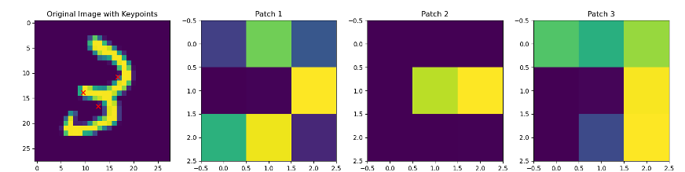
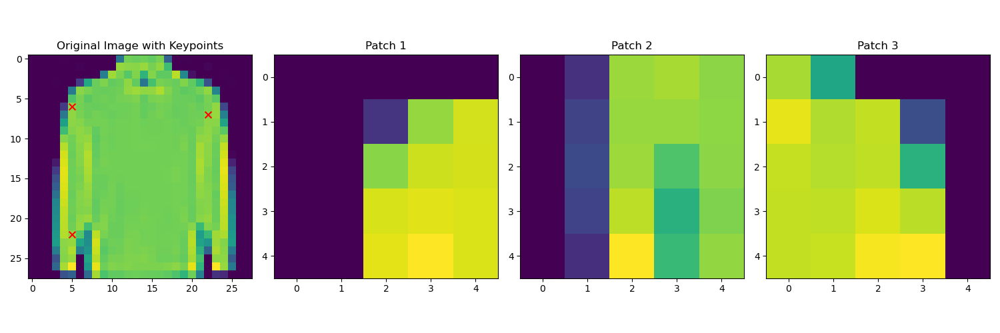

# Unboxing the Black Box: Explainable and Efficient CNNs with Focus and Attention

This final project explores how incorporating principles of human visual focus can improve the **explainability** and **efficiency** of Convolutional Neural Networks (CNNs) without significantly compromising accuracy.

We propose two strategies:

* **Focus-based models**, which extract and process only the most informative regions of an image.
* **Attention-based models**, which use internal CNN representations to identify and emphasize important features.

By mimicking human visual attention, our goal is to enhance interpretability and reduce computational costs.

---

## Models

### Focus-Based CNNs

Implemented in `models/focus/`, this approach uses learned or algorithmically identified **keypoints** to isolate informative patches from an image. Only these patches are fed to a smaller classifier, making the model interpretable and much more efficient.

* **Learned keypoints** (focus model): A CNN identifies keypoints and is trained end-to-end.
* **Corner keypoints** (corner model): Uses Harris corner detection instead of learning.

### Attention-Based CNNs

Found in `models/attention/`, this model taps into CNN intermediate layers to generate attention maps. These maps highlight both local and global features that guide the final classification decision.

---

## Results

### Focus Model Used on MNIST

Here we see the learned keypoints (red dots) on the MNIST dataset. The model learned to put the keypoints on the coves of the 3 and the middle line.

### Corner Model Used on Fashion-MNIST

Here the corner model is puts the keypoints on the corners of the clothing items like the shoulder and the end of the sleeves.

### Attention Model Used on CIFAR-10

Here the heatmap shows the attention of the model on the CIFAR-10 dataset. The attention is most one the foreground objects.

| Model           | MNIST | Fashion-MNIST | CIFAR-10 | Efficiency |
| --------------- | ----- | ------------- | -------- | ---------- |
| Focus (learned) | 98%   | 86%           | 52%      | Medium     |
| Focus (corners) | 86%   | 72%           | 34%      | High       |
| Attention-based |       |               | 79%      | Low        |

* Focus models require much fewer parameters and improve explainability by labeling keypoints.
* Attention models maintain accuracy while enhancing interpretability via attention maps.

---

## Project Structure

```bash
.
├── models
│   ├── attention
│   │   ├── attention_main.py
│   │   └── attention_model.py
│   ├── focus
│   │   ├── focus_main.py
│   │   ├── focus_model.py
│   │   ├── focus_sizing_main.py    # an old implementation of focus model
│   │   └── focus_sizing_model.py   # that used zooming for easier gradient calculation
│   └── saliency
│       ├── saliency_main.py
│       ├── saliency_model.py
│       └── Saliency_Reconstruction_Training.ipynb # experiment using VAE/GANs 
├── graph.ipynb     # Plot model results
├── report/
│   ├── report.tex
│   └── report.pdf
```

---

## References
* [Jetley et al., 2018](https://arxiv.org/abs/1806.02883)
* [Yan et al., 2019](https://link.springer.com/chapter/10.1007/978-3-030-20351-1_62)
* [Zhao et al., 2020](https://arxiv.org/abs/2004.13621)
* Simonyan and Zisserman’s [VGG-16](https://arxiv.org/abs/1409.1556)

See the full [report](report/report.pdf)